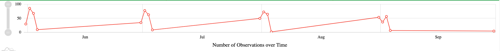
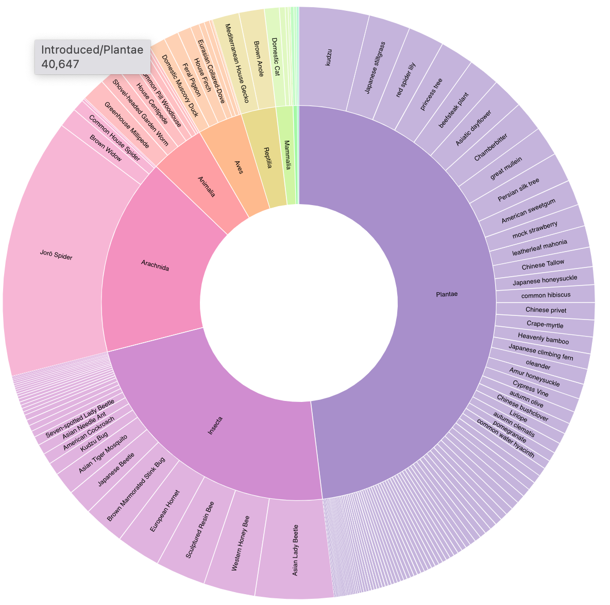
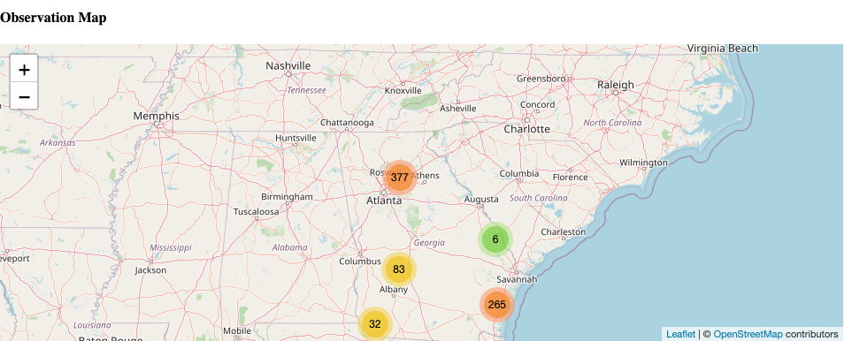
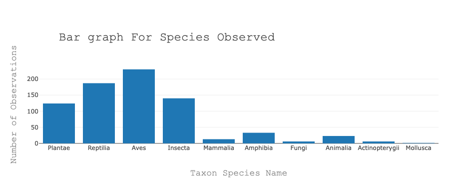

# invasive_species

For project 3, we used the iNaturalist API to build a dashboard that shows 2,665 observations from the last 4 months, starting in Jun 2021 to Sep 2021. 

## Visualizations

### Observations Over Time Chart

This chart shows the dates where the observations were recorded for each month. Because of our limited dataset, we were only able to recieve observations from the beginning of each month. In the future, with a larger database of observations, we hope this will be a great tool to see what dates had many or little observations in Georgia. 

This chart was created using amcharts.js (https://www.amcharts.com/)

### Sunburst Taxon Chart

This chart show the distribution of observations by Taxon (Plantae, Insecta, Aves, etc.) and common name. This is an interactive chart that allows the user to select a taxon and then see a drileld down view of the common name distribution. 

This chart was created using D3.js (https://d3js.org/)

### Observation Map

This map uses marker clusters to show the exact location for observations in our database. This is an interactive visualization which allows the user to zoom in to view the individual clusters for exact sightings, or zoom out for a broad count of observations in an area. 

This chart was created using leaflet.js (https://leafletjs.com/)

### Taxon Bar Chart

This chart shows the number of observations by taxon (plantae, amphibia, etc.) and is hoverable so the user can see the exact number. 

This chart was created with plotly.js (https://plotly.com/javascript/)

### App Back-End

The application is hosted by Heroku and uses a Flask server implementation. We also have a PostgresSQL database hosted by Heroku. 